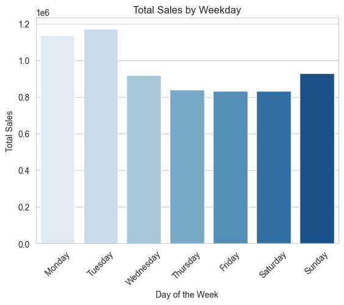
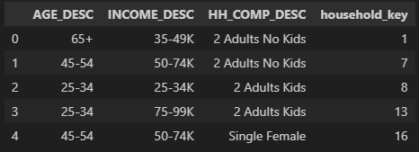
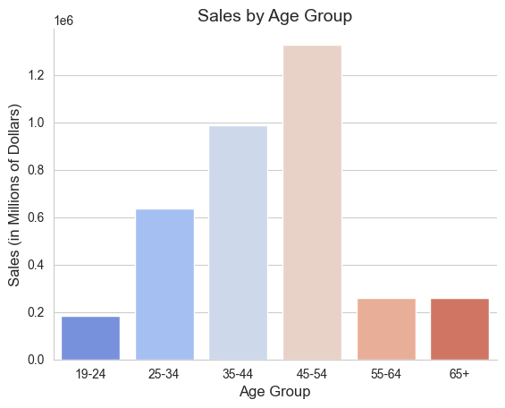
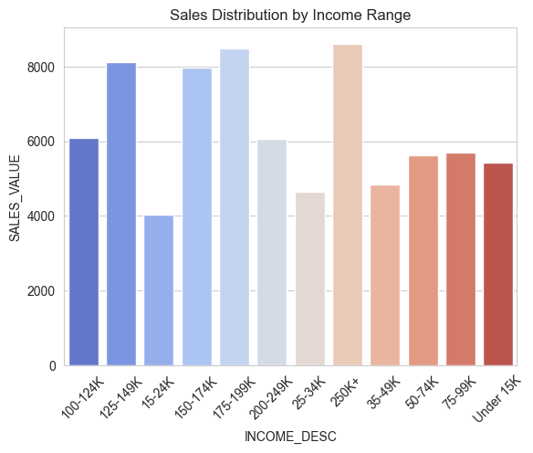
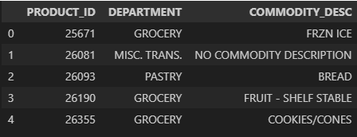
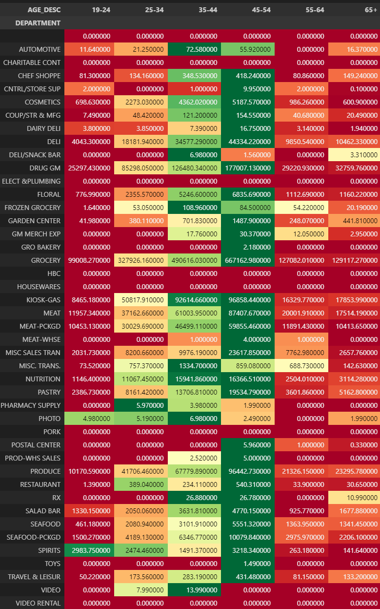

# Maven Mega Mart


## 📌 TL;DR
This project analyzes **2M+ sales transactions** to help Maven MegaMart evaluate a **potential acquisition**. We uncover **steady sales growth (2016-2017)**, peak sales on **Mondays and Tuesdays**, and high revenue contributions from **young single-parent households**.  

### 🔑 Key Recommendations:  
- **Targeted Promotions**: Focus on young single-parent households and low-income groups.  
- **Inventory Optimization**: Ensure high availability of key products in peak sales months.  
- **Data-Driven Expansion**: Align product offerings with profitable customer segments.  

---

## 🏢 Project Overview
Maven MegaMart, a multinational retail and grocery chain, is exploring the acquisition of a new retailer. To support this decision, we analyze **over 2 million transactions** to:  

✔️ Identify key **sales trends & customer behavior**  
✔️ Evaluate the **effectiveness of discount strategies**  
✔️ Uncover **customer behavior and purchasing patterns**  
✔️ Provide **data-driven recommendations** for marketing & expansion

## 🛠 Methodology

We leverage **Python (Pandas, NumPy, Matplotlib, Seaborn)** for:  
- **Data Wrangling:** Efficiently reading, merging, and analyzing large datasets  
- **Time-Series Analysis:** Identifying growth trends and seasonal patterns  
- **Data Visualization:** Communicating insights with heatmaps, bar charts & plots  

---  

## 📊 **Data Overview**  
We analyze **multiple datasets** containing:  
📍 **Transactions** – Store-level sales data (date, product, revenue)  
📍 **Products** – Brand, category, and department details  
📍 **Households** – Customer demographics (age, income, household size)  

---  

## 📈 Key Findings  

### 1️⃣ **Sales Trends Over Time**  
- **2017 sales outperformed 2016**, showing **positive growth** 📈  
- **Mondays & Tuesdays** had the **highest** sales, while **Saturdays had the lowest**  

### 2️⃣ **Customer Demographics & Spending Behavior**  
- **Young single-parent households (19-24 years old) spend 15% more** than other groups  
- **Lower-income groups ($15K-$34K) are key revenue contributors**, aligning with discount strategy  

### 3️⃣ **Product Category Insights**  
- **Spirits (alcohol) is the most purchased category among young consumers**  
- **Dairy & beverages** drive sales during peak months  

---  

## 🗃️ Data Processing & Preparation
✅ Loading Transactions Data  
✅ Read in the columns - `household_key`, `basket_id`, `STORE_ID`, `DAY`, `QUANTITY`, and `SALES_VALUE`.  
✅ Convert `DAY`, `QUANTITY`, and `STORE_ID` to the smallest appropriate integer type.  
✅ Creating Date Column from DAY Field

#### Read the data and work on the columns
```
path = "data/project_transactions.csv"
cols = ["household_key", "BASKET_ID", "DAY", "PRODUCT_ID", "QUANTITY", "SALES_VALUE"]
dtypes = {
    "DAY": "Int16",
    "QUANTITY": "Int32",
    "STORE_ID": "Int32",
    "PRODUCT_ID": "Int32"
}

# store the data into transaction dataframe
transactions = pd.read_csv(path, dtype=dtypes, usecols=cols)
```


#### Now we need to create Data column based on the value of 'DAY' for `transaction` table and drop the `"DAY"` column
```
transactions = transactions.assign(
    Date = (pd.to_datetime("2016", format='%Y')
    + pd.to_timedelta(transactions["DAY"].sub(1).astype(str) + ' days'))
).drop(["DAY"], axis=1)
```


## 📈 Time-Series Analysis & Trends
✅ Plot the sum of sales by month. Are sales growing over time?  
✅ Monthly Sales Trends (2016-2017)  
✅ Sales Comparison: 2016 vs. 2017  
✅ Sales by Day of the Week  

### Sales by Month
To have a full set of household observations we should filter down the date. By applying the specific date, we have a nice steady growth month over month, which shows we have a healthy company.

```
sns.set_style('whitegrid')# Improve visualization aesthetics

transactions.set_index('date').sort_index().loc['2016-04':'2017-10', 'SALES_VALUE'].resample('M').sum().plot()

plt.title('Monthly Sales (Apr. 2016 - Oct. 2017)', size=14)
plt.xlabel('Month', size=12)
plt.ylabel('Sales', size=12)
plt.grid(alpha=0.3, axis='y')
sns.despine();

```


### Sales by Year

```
sns.set_style('whitegrid')  #Improve visualization aesthetics
(transactions
 .set_index("date")
 .loc[:, ["SALES_VALUE"]]
 .resample("M")
 .sum()
 .assign(year_prior = lambda x: x["SALES_VALUE"].shift(12))
 .loc['2017']).plot()

plt.title('2017 Monthly Sales vs. 2016 Monthly Sales', size=14)
plt.xlabel('Month', size=12)
plt.ylabel('Sales', size=12)
plt.legend(['2017 Sales', '2016 Sales'], loc='best')
plt.grid(alpha=0.3, axis='y')
sns.despine();
```


Ignoring the ramp of from Jan 2016 ( line orange ) and the sharp decline in the last month of 2017 ( line blue ), we can see clearly our overal of 2017 sales are higher than 2016. We also see a couple similar seasonal fluctuations that do look much stronger in 2017.


### Total Sales by Week-Day
```
sales_by_day = (transactions
    .groupby(transactions["date"].dt.day_name())
    .agg({"SALES_VALUE": "sum"})
    .reindex(["Monday", "Tuesday", "Wednesday", "Thursday", "Friday", "Saturday", "Sunday"])  # Ensure correct order
)

sns.barplot(x=sales_by_day.index, y=sales_by_day["SALES_VALUE"].values, palette='Blues')
plt.title('Total Sales by Weekday')
plt.xlabel('Day of the Week')
plt.ylabel('Total Sales')
plt.xticks(rotation=45)  # Rotate labels for better readability
plt.show()


```


Based on the bar chart, highest sales are on Monday and Tuesday followed by Sunday. It might be interesting to dive further into why more customers are coming in on these days.

<br/>

## 🛍 Customer Demographics Analysis  

To understand **customer composition and spending behavior**, we:  

✅ Read the **hh_demographic.csv** file, selecting key columns:  
   - `AGE_DESC`: Age group  
   - `INCOME_DESC`: Income range  
   - `HH_COMP_DESC`: Household composition  
   - `household_key`: Unique household identifier  

✅ Converted categorical columns to optimize memory usage.  

✅ Aggregated **total sales per household** and merged it with demographic data.  

✅ Created **pivot tables and visualizations** to identify key **spending segments**. 

```
# read in sub sets of the columns, then
# convert these column to category data type, to save ton of data for further join to transactions table, and having repeated column 

dem_cols = ["AGE_DESC", "INCOME_DESC", "household_key", "HH_COMP_DESC"]
dem_dtypes = {"AGE_DESC": "category", "INCOME_DESC": "category", "HH_COMP_DESC": "category"}
demographics = pd.read_csv("data/hh_demographic.csv", usecols=dem_cols, dtype=dem_dtypes)
demographics.head()

```



<br/>

### Join ```household``` table to ```demographic``` table
To analyze the demographics of our households

```
household_sales_demo = (household_sales.merge(demographics,
                        how="inner",
                        on= "household_key",
                        ))
```


We have 668 households for analysis.

### Sum of Sales value by Age category

```
sns.set_style('whitegrid')  # Improve visualization aesthetics

# Aggregate sum of SALES_VALUE by AGE_DESC
sales_sum = demographic_plus_household.groupby('AGE_DESC', as_index=False)['SALES_VALUE'].sum()

# Plot using Seaborn
sns.barplot(x=sales_sum['AGE_DESC'], y=sales_sum['SALES_VALUE'], data=sales_sum, palette='coolwarm', errorbar=None)

plt.title('Sales by Age Group', size=14)
plt.ylabel('Sales (in Millions of Dollars)', size=12)
plt.xlabel('Age Group', size=12)
sns.despine()
plt.show();

```



### Sum of Sales value by Income category

```
sns.set_style('whitegrid')  # Improve visualization aesthetics

(demographic_plus_household.groupby('INCOME_DESC')['SALES_VALUE']
                           .sum()
                           .sort_values(ascending=False))

sns.barplot(x=demographic_plus_household['INCOME_DESC'], y=demographic_plus_household["SALES_VALUE"], data=demographic_plus_household, palette='coolwarm',errorbar=None)
plt.title('Sales Distribution by Income Range')
plt.xticks(rotation=45)
plt.figure(figsize=(10,6))
plt.show()


```



This is the most common household income demographis in the US, but it worth nothing that even our under-15K and 25-34K demographics are much higher than some of the higher income demographic. so, if we are looking at the discount retailor, it makes sense that we're attracting a lot of these lower income groups and this is expected by a leadership.

### Household Composition Heatmap
To show the households composition by a heat-map. This shows us which our demographic is producing the most revenue by household, and also aloow us to think about ways we can combine our strategy in terms of marketing with our aquisition targets.
```
(household_sales_demo.pivot_table(index="AGE_DESC",
                                  columns="HH_COMP_DESC",
                                  values="SALES_VALUE",
                                  aggfunc="mean",
                                  margins=True)
                     .style.background_gradient(cmap="RdYlGn", axis=None)
 ```
 
 
 
The heatmap shows that our average sales for single parent homes at a young age (19-24) have a very high sales. so, we should figure out how to help these single family homes as part of shopping experience. we might also look at focusing on families with children in general; is there a way that we can revamp our product distribution, is there a way that we can target our marketing more specificly towards these groups.

<br/>

## 🛒 Product Category Analysis  

To analyze product performance across customer demographics, we:  

✅ Read in the **products.csv** file, selecting only:  
   - `PRODUCT_ID`: Unique product identifier  
   - `DEPARTMENT`: Product department  

✅ Merged the **product data** with transactions and demographics using an **inner join**.  

✅ Created a **pivot table** to analyze **sales by age group and department**.

✅ Which category is led by our youngest age demographic?




<br/>


## Join All Tables Toghether

```
# Merge dataframes

combined_df = (
 transactions.merge(demographics, 
                    how='inner', 
                    left_on='household_key', 
                    right_on='household_key')
                    .merge(products, how='inner', 
                    left_on='PRODUCT_ID', 
                    right_on='PRODUCT_ID')
              )

combined_df.head()
```


<br/>

## Department by Age
This pivot table helps us to to look at the areas among young customers. Are they going to be our next generation of customers for the company?
```
(combined_df.pivot_table(index='DEPARTMENT', 
                        columns='AGE_DESC',
                        values='SALES_VALUE', 
                        aggfunc='sum')
                        .style.background_gradient(cmap="RdYlGn", axis=1))

```



The young customers are interested in SPIRITS ( alcohol )!


<br/>


### Export Pivot Table to an Excel File
```
(trans_demo_dept.pivot_table(
                            index="DEPARTMENT",
                            columns="AGE_DESC",
                            values="SALES_VALUE",
                            aggfunc="sum"
                            ).style.background_gradient(cmap="RdYlGn", axis=1)
                            .to_excel("demographic_category_sales.xlsx", sheet_name="sales_pivot")
)
```

## 🛠 Challenges & Solutions  

### ⚠️ Handling Large Datasets (2M+ Rows)  
✅ Used optimized Pandas operations (dtype adjustments, column selection).  

### ⚠️ Ensuring Accurate Time-Series Analysis  
✅ Sorted and filtered data before resampling.  

### ⚠️ Making Demographic Insights Actionable  
✅ Merged sales + household data, generating heatmaps for revenue distribution.  

---  

## 📊 Business Recommendations  

### ✅ Optimize Marketing Strategies  
- **Target promotions** toward young single parents & low-income households  
- **Run weekday promotions** to boost weekend sales  
- **Leverage high sales in Spirits & Snacks** to attract younger customers  

### ✅ Inventory & Pricing Adjustments  
- **Ensure high availability of dairy & beverages** in peak months  
- **Maintain competitive discount strategies** without margin loss  

### ✅ Expansion Strategy  
- **Acquire retailers** with strong customer bases in key demographics  
- **Align product offerings** with profitable customer segments  

---  

## 📌 Conclusion  
This analysis provides **data-driven insights** to support Maven MegaMart’s acquisition decision. By leveraging **sales trends, customer demographics, and product performance**, the company can refine its **marketing, inventory, and pricing strategies** for **sustained business growth**.  

---  

## 🎯 Technical Skills Demonstrated  
✔️ **Data Wrangling:** Merging, filtering, and transforming large datasets  
✔️ **Data Visualization:** Creating insightful plots and heatmaps using Matplotlib & Seaborn  
✔️ **Business Intelligence:** Extracting key metrics for decision-making  
✔️ **SQL & Pandas:** Aggregating & analyzing millions of transactions efficiently  

--- 

💼 **Interested in data-driven decision-making? Let’s connect!**  

📩 Feel free to reach out via [LinkedIn](https://www.linkedin.com/in/manohark1999/) or check out more projects on my [GitHub](https://github.com/ManoharManu1999).

🔗 **Explore the Full Analysis in the Jupyter Notebook:** [Maven_MegaMart_Analysis.ipynb](Maven_MegaMart_Analysis.ipynb)

This project highlights my ability to perform **end-to-end data analysis**, from data extraction to actionable business recommendations.

